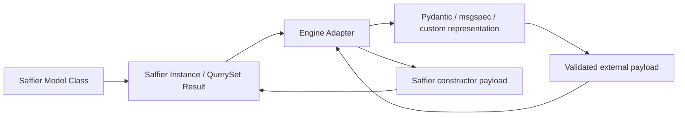

# Model Engines

Saffier model engines are optional adapters layered on top of the normal ORM
model layer.

The important architectural rule is the direction of ownership:

* Saffier owns fields, relations, defaults, validation hooks, identity,
  querysets, lifecycle, and database mapping.
* An engine only projects a Saffier model into another representation or
  validates external data before you turn it back into a Saffier model.
* If you do nothing, Saffier keeps working exactly as it does in pure Python
  mode.

This is not "make Saffier depend on Pydantic" or "make msgspec the new model
foundation". It is "keep Saffier complete on its own, and let engines sit on
top of it when useful".

## Why Saffier supports engines

Some applications want an extra model interface for:

* API-facing validation
* schema generation
* typed serialization
* interoperability with another Python model ecosystem

Saffier now supports that without making the ORM depend on any one engine or
rewriting core ORM semantics around one library.

## Core philosophy

Saffier is a Python-first, engine-agnostic ORM.

That means:

* the ORM is complete with no engine configured;
* query behavior does not change when you enable an engine;
* engine adapters consume Saffier model payloads instead of replacing Saffier models;
* future engines can be added by registration, not by changing core ORM semantics.

## Mental model

Think of the feature in three layers:

1. Saffier model declaration and runtime behavior
2. Optional engine adapter selection
3. Engine-backed projection or validation

In practice, the flow looks like this:



The left side never disappears. The right side is optional.

## Default mode: no engine

No configuration is required.

```python
import saffier


class User(saffier.Model):
    name = saffier.CharField(max_length=100)

    class Meta:
        registry = models
```

`User` keeps the normal Saffier lifecycle:

* `save()`
* `update()`
* `delete()`
* `load()`
* `model_dump()`

No engine-backed model is created unless you opt in.

## Engine configuration points

Saffier resolves engine selection in this order:

1. `Meta.model_engine`
2. `Registry(model_engine=...)`
3. no engine

Use those entry points like this:

* `Meta.model_engine = "pydantic"` or `"msgspec"` for one model
* `Meta.model_engine = False` to opt out of a registry default
* `Registry(model_engine="pydantic")` or `"msgspec"` for a registry-wide default

## Configure a registry-wide engine

Use `Registry(model_engine=...)` when most models in one application should
expose the same engine adapter.

```python
{!> ../docs_src/engines/registry_default.py !}
```

With that configuration:

* `user.to_engine_model()` returns the engine-backed representation
* `User.engine_validate(data)` validates external data with the engine adapter
* `User.from_engine(value)` turns an engine-backed value back into a normal
  Saffier model
* `User.engine_json_schema()` exposes the engine-generated schema when the
  adapter supports it

Saffier currently ships two built-in adapters:

* `pydantic`
* `msgspec`

## Per-model override and opt-out

Registry defaults are convenient, but not every model needs the same adapter.

```python
{!> ../docs_src/engines/per_model.py !}
```

Rules:

* `Meta.model_engine = "pydantic"` selects one named adapter for that model.
* `Meta.model_engine = False` disables the registry default for that model.
* If `Meta.model_engine` is omitted, the registry default is used.

This makes gradual adoption practical: turn an engine on for one model, one
app, or one registry at a time.

## Engine-facing model APIs

When an engine is configured, models expose the following opt-in helpers:

* `Model.get_model_engine_name()`
* `Model.get_model_engine()`
* `Model.get_engine_model_class(mode="projection" | "validation")`
* `Model.engine_validate(value, mode="validation")`
* `Model.from_engine(value, exclude_unset=True)`
* `instance.to_engine_model(...)`
* `instance.engine_dump(...)`
* `instance.engine_dump_json(...)`
* `Model.engine_json_schema(mode="projection" | "validation")`

These methods do not replace `model_dump()`, `save()`, `load()`, `update()`,
or queryset behavior. They are an additional adapter surface.

## Projection mode vs validation mode

Engine adapters intentionally separate two use cases:

* `projection` mode is for taking an existing Saffier instance and projecting
  it into the engine-backed representation
* `validation` mode is for validating external input before it becomes a
  Saffier instance

Use them like this:

```python
payload = User.engine_validate({"name": "Ada", "email": "ada@example.com"})
user = User.from_engine(payload)

engine_user = user.to_engine_model()
schema = User.engine_json_schema(mode="validation")
```

That split keeps Saffier's own runtime semantics intact while still allowing
engine-specific validation and schema generation.

## Pydantic adapter

Saffier ships a built-in `pydantic` adapter for projects that want Pydantic
models as an optional projection layer.

The built-in Pydantic adapter is intentionally layered on top of Saffier.

```python
payload = User.engine_validate({"name": "Ada", "email": "ada@example.com"})
user = User.from_engine(payload)

engine_user = user.to_engine_model()
engine_user.model_dump(exclude_unset=True)
# {"name": "Ada", "email": "ada@example.com"}

user.engine_dump()
user.engine_dump_json()
User.engine_json_schema(mode="validation")
```

What it is good for:

* request and response validation
* OpenAPI-leaning workflows
* Pydantic-native schema generation
* gradual integration in applications that already use Pydantic elsewhere

## msgspec adapter

Saffier also ships a built-in `msgspec` adapter.

```python
{!> ../docs_src/engines/msgspec.py !}
```

What it is good for:

* fast typed validation
* compact JSON serialization
* msgspec-native schema generation
* applications that prefer `msgspec.Struct` instead of Pydantic models

## Relation and queryset behavior

Engines do not change how querysets work.

These all remain owned by Saffier:

* `select_related()`
* `prefetch_related()`
* `save()`
* `update()`
* `load()`
* identity and primary-key handling
* relation descriptors and reverse relations

If you load a related graph through Saffier and then call `to_engine_model()`,
the adapter projects whatever Saffier has already materialized.

That means the engine layer is downstream of queryset behavior, not upstream of
it.

## Serialization behavior

There are now two distinct serialization paths:

* `model_dump()` is the native Saffier serializer
* `engine_dump()` is the engine-backed serializer

Use native Saffier dumping when you want pure ORM semantics with no extra
dependency on an engine representation.

Use `engine_dump()` when you want serialization to follow the configured engine
adapter's projection rules.

## Validation behavior

Saffier still validates fields and persistence payloads itself.

The engine layer adds optional validation for external data flows. A typical
pattern looks like this:

```python
validated = User.engine_validate(input_payload)
user = User.from_engine(validated)
await user.save()
```

This is intentionally additive. It does not replace Saffier's own save/update
validation.

## JSON schema generation

Saffier now exposes two schema directions:

* `model_json_schema()` for the existing Saffier/admin/marshalling-oriented
  schema behavior
* `engine_json_schema()` for engine-specific JSON schema output

That keeps schema generation explicit instead of overloading one method with two
different ownership models.

## Inheritance, proxies, and copied registries

Engine settings participate in the same inheritance and copy flows as the rest
of model metadata.

That means:

* abstract base models can define `Meta.model_engine`
* child models inherit the engine choice unless they override it
* proxy-model generation keeps the engine configuration
* copied registries preserve registry-level engine defaults

This matters because engine support should not disappear when Saffier clones a
model or registry internally.

## Custom engine adapters

Custom adapters inherit from `saffier.ModelEngine` and register themselves by
name.

Here is the smallest useful example:

```python
{!> ../docs_src/engines/custom.py !}
```

Then attach it through `Registry(model_engine="dict")` or
`Meta.model_engine = "dict"`.

### What each adapter method is responsible for

`get_model_class()`

Creates or returns the engine-backed class used for one Saffier model.

`validate_model()`

Accepts external data or an existing Saffier instance and returns the
engine-backed value.

`to_saffier_data()`

Converts an engine-backed value back into a constructor payload suitable for
`Model(...)`.

`json_schema()`

Returns the engine-backed JSON schema for the model.

### Recommended custom-engine workflow

1. Start with a simple adapter around a mapping or dataclass representation.
2. Make sure projection works first.
3. Add validation.
4. Add round-trip conversion back to Saffier.
5. Add schema generation last if your engine supports it.

The adapter contract is intentionally small because the engine layer should stay
focused on representation, not ORM ownership.

## Custom-engine checklist

When implementing a custom adapter, make sure you account for:

* nullable Saffier fields
* read-only or computed fields
* auto-generated primary keys
* nested related payloads
* plain Python fields declared on the model
* dump and JSON serialization behavior
* schema generation support or explicit lack of it

## Future engines and extension points

The built-in architecture is deliberately generic enough for adapters such as:

* `msgspec`
* `attrs`
* project-specific dataclass or schema systems

Those integrations do not require changing Saffier querysets, fields, or
persistence flows. They only need an adapter that consumes Saffier-owned model
definitions and payloads.

## Guarantees

Saffier guarantees:

* core ORM semantics stay engine-independent;
* no engine is required for normal model usage;
* enabling an engine does not change queryset, relation, or save/load behavior;
* engine-backed representations are projections of Saffier models, not
  replacements for them;
* model copies, registry copies, and inherited models preserve engine
  configuration.

## Limitations

Current limits are intentional:

* Saffier currently ships built-in adapters for `pydantic` and `msgspec`.
* Relation projection is serialization-oriented. Saffier still owns relation
  loading and identity.
* Engine methods are opt-in APIs. Existing code that only uses normal Saffier
  models does not need to change.
* Different engines may expose slightly different validation and dumping
  semantics because the adapter follows the target engine rather than pretending
  every engine behaves identically.

## Migration guidance

For existing projects:

1. Keep current models unchanged if you do not need an engine.
2. If you want one engine across an app, add `model_engine="pydantic"` or
   `model_engine="msgspec"` to the registry.
3. If you want a gradual rollout, set `Meta.model_engine` only on selected
   models.
4. If a registry has a default engine and one model should stay pure Saffier,
   use `Meta.model_engine = False`.
5. Move external validation flows to `engine_validate()` and `from_engine()`
   without changing queryset or persistence code.

The core rule stays the same throughout migration: Saffier models remain the
source of truth.
